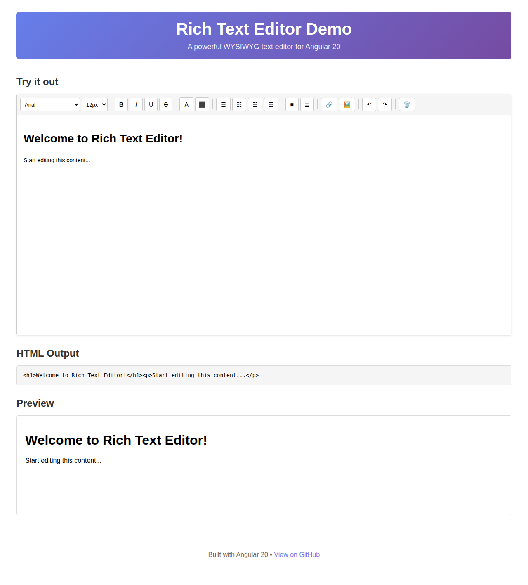

# Rich Text Editor for Angular 20

A powerful and feature-rich WYSIWYG text editor component for Angular 20, similar to Microsoft Word.



## 🚀 Features

- ✨ **Rich Text Formatting**: Bold, Italic, Underline, Strikethrough
- 🎨 **Text & Background Colors**: Full color picker support
- 📝 **Font Customization**: Multiple font families and sizes
- 📐 **Text Alignment**: Left, Center, Right, Justify
- 📋 **Lists**: Ordered and Unordered lists
- 🔗 **Insert Links & Images**: Easy media integration
- ↶↷ **Undo/Redo**: Full edit history support
- 🗑️ **Clear Formatting**: Remove all formatting with one click
- 📱 **Responsive Design**: Works on all screen sizes
- 🎯 **Standalone Component**: No module imports required
- 🔄 **Two-way Data Binding**: Easy content management

## 📦 Installation

```bash
npm install @sofer1445/rich-text-editor
```

## 🛠️ Usage

### Basic Usage

```typescript
import { Component } from '@angular/core';
import { RichTextEditorComponent } from '@sofer1445/rich-text-editor';

@Component({
  selector: 'app-root',
  standalone: true,
  imports: [RichTextEditorComponent],
  template: `
    <rte-rich-text-editor
      [(content)]="editorContent"
      [placeholder]="'Start typing...'"
      [height]="'500px'"
      (onContentChange)="handleContentChange($event)">
    </rte-rich-text-editor>
  `
})
export class AppComponent {
  editorContent = '';

  handleContentChange(content: string) {
    console.log('Content changed:', content);
  }
}
```

### Advanced Usage

```typescript
import { Component, ViewChild } from '@angular/core';
import { RichTextEditorComponent } from '@sofer1445/rich-text-editor';

@Component({
  selector: 'app-demo',
  standalone: true,
  imports: [RichTextEditorComponent],
  template: `
    <div>
      <button (click)="getEditorContent()">Get Content</button>
      <button (click)="setEditorContent()">Set Content</button>
      
      <rte-rich-text-editor
        #editor
        [(content)]="content"
        [placeholder]="'Type your content here...'"
        [height]="'600px'">
      </rte-rich-text-editor>
    </div>
  `
})
export class DemoComponent {
  @ViewChild('editor') editor!: RichTextEditorComponent;
  content = '<h1>Welcome!</h1><p>Start editing...</p>';

  getEditorContent() {
    const htmlContent = this.editor.getContent();
    console.log('Current content:', htmlContent);
  }

  setEditorContent() {
    this.editor.setContent('<p>New content loaded!</p>');
  }
}
```

## 🎨 Component API

### Inputs

| Property | Type | Default | Description |
|----------|------|---------|-------------|
| `content` | `string` | `''` | Initial HTML content |
| `placeholder` | `string` | `'Start typing...'` | Placeholder text when editor is empty |
| `height` | `string` | `'400px'` | Height of the editor |

### Outputs

| Event | Type | Description |
|-------|------|-------------|
| `contentChange` | `EventEmitter<string>` | Emits when content changes (for two-way binding) |
| `onContentChange` | `EventEmitter<string>` | Emits when content changes |

### Methods

| Method | Parameters | Return Type | Description |
|--------|-----------|-------------|-------------|
| `getContent()` | - | `string` | Returns the current HTML content |
| `setContent(content)` | `content: string` | `void` | Sets the editor content |
| `clearFormatting()` | - | `void` | Removes all formatting from selected text |

## 🎯 Toolbar Features

### Text Formatting
- **Bold** (Ctrl+B)
- **Italic** (Ctrl+I)
- **Underline** (Ctrl+U)
- **Strikethrough**

### Font Customization
- Font Family (Arial, Times New Roman, Courier New, Georgia, Verdana, Comic Sans MS, Impact, Trebuchet MS)
- Font Size (8px to 72px)

### Colors
- Text Color
- Highlight/Background Color

### Alignment
- Align Left
- Align Center
- Align Right
- Justify

### Lists
- Bullet List
- Numbered List

### Insert
- Links
- Images

### History
- Undo (Ctrl+Z)
- Redo (Ctrl+Y)

## 🎨 Styling

The editor comes with a clean, modern design out of the box. The component uses scoped styles that won't interfere with your application's styles.

## 🔧 Development

### Building the Library

```bash
# Install dependencies
npm install

# Build the library
npm run build
```

### Running Tests

```bash
npm test
```

## 📋 Requirements

- Angular 20.3.0 or higher
- @angular/forms 20.3.0 or higher

## 🤝 Contributing

Contributions are welcome! Please feel free to submit a Pull Request.

## 📄 License

MIT License

## 👤 Author

**sofer1445**

- GitHub: [@sofer1445](https://github.com/sofer1445)

## 🙏 Support

If you like this project, please give it a ⭐ on GitHub!
